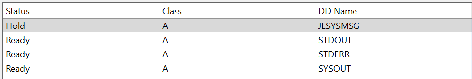

# Calling Java from COBOL by Using Enterprise Developer for Eclipse

Rocket&reg; Enterprise Suite products provide a proprietary runtime engine to enable compatibility for customers’ IBM CICS applications. IBM and CICS are registered trademarks of International Business Machines Corp. Rocket Enterprise Suite products do not include an IBM CICS engine and are not affiliated with IBM.

## Contents
- [Overview](#overview)
- [Prerequisites](#prerequisites)
- [Creating the Java Project](#creating-the-java-project)
- [Configuring the Region for Java](#configuring-the-region-for-java)
- [Compiling the COBOL Bootstrap Program](#compiling-the-cobol-bootstrap-program)
- [Running the Java Batch Job](#running-the-java-batch-job)
- [Debugging COBOL and Java Together](#debugging-cobol-and-java-together)
- [Further Java Samples](#further-java-samples)
- [Troubleshooting](#troubleshooting)

## Overview

This demonstration continues the [Getting Started with Enterprise Developer for Eclipse](README.md) tutorial. It shows you how to run a Java class from a batch JCL job under the same BANKDEMO enterprise server region you have already been using, and how to debug a single run that passes from COBOL into Java and back again.

The Java code is kept in a separate Eclipse project. The Bankdemo project remains a COBOL project, and the two are connected only by the region configuration, which is how Enterprise Server itself sees them.

You will:

- Create a Java project and link the sample Java sources into it.
- Configure the BANKDEMO region so that the Java runtime and the compiled classes can be found.
- Compile the COBOL program that calls Java.
- Submit a job that runs Java and inspect the redirected output streams.
- Debug from COBOL into Java and back in one run.

## Prerequisites

[Back to Top](#overview)

- You have completed the [Getting Started with Enterprise Developer for Eclipse](README.md) tutorial. This demonstration uses the Bankdemo project, the Eclipse workspace and the BANKDEMO region created there.
- A Java Development Kit (JDK) is installed. Enterprise Developer supplies one on Windows, in the `AdoptOpenJDK` folder of the product installation.
- The BANKDEMO region has been imported from `tutorial/BANKDEMO.template` and starts successfully.

> **Note:** The [Java Batch Interoperability](../../interoperability/batch/java/README.md) tutorial covers the same Java samples from the command line, using the separate BANKVSAM region created by the provisioning scripts. You do not need it to complete this demonstration.

## Creating the Java Project

[Back to Top](#overview)

 In the Getting Started tutorial you created the Bankdemo project from a supplied COBOL project template. Eclipse has no equivalent template mechanism for Java projects, so you create this one directly, then link the sample sources into it exactly as you linked the COBOL sources.

> **Tip:** If you would rather not create the project by hand, a preconfigured copy is supplied in `tutorial/projects/Eclipse/java`, together with the debug configurations used later in this demonstration. Click **File \> Import**, expand **General**, select **Existing Projects into Workspace**, browse to that directory, and clear **Copy projects into workspace** so that the project is imported in place. Then skip to [Adding the Enterprise Server Java Library](#adding-the-enterprise-server-java-library), and note the change to the `CLASSPATH` value described in the next section.

**Creating the Project**

1.  Click **File \> New \> Project**.
2.  Expand **Java**, select **Java Project** and click **Next**.

    If the **Java** category is not listed, click **Window \> Perspective \> Open Perspective \> Other \> Java** and try again.

3.  In the **Project name** field, type `BankdemoJava`.
4.  Leave **Use default location** selected, so that the project is created in the workspace you specified when you started Eclipse.
5.  Clear **Create module-info.java file** if it is selected. The sample classes are in the default package and do not declare a module.
6.  Click **Finish**.

    If you are prompted to open the Java perspective, click **Open Perspective**.

**Adding the Java Source Files**

As with the COBOL sources, you link the sample files into the project rather than copying them, so that you are editing the files in the sample directory:

1.  In **Package Explorer**, right-click the **BankdemoJava** project and click **New \> Folder**.
2.  Click **Advanced** and select **Link to alternate location (Linked Folder)**.
3.  Click **Browse**, navigate to the `sources/java` folder of the sample - for example, `C:\MFETDUSER\sources\java` on Windows, or `/home/username/MFETDUSER/sources/java` on Linux - and click **Select Folder**.
4.  In the **Folder name** field, type `java` and click **Finish**.
5.  Right-click the linked **java** folder and click **Build Path \> Use as Source Folder**.

    Eclipse compiles the sample classes and reports errors, because the Enterprise Server Java API is not yet on the build path.

**<a name="adding-the-enterprise-server-java-library"></a>Adding the Enterprise Server Java Library**

The samples import `com.rocketsoftware.jzos`, which is supplied with Enterprise Developer:

1.  Right-click the **BankdemoJava** project and click **Properties**.
2.  Click **Java Build Path** and then click the **Libraries** tab.
3.  Select **Classpath**, click **Add Library**, select **ES Java Support Library**, click **Next**, then **Finish**.
4.  Click **Apply and Close**.

    Eclipse rebuilds the project. The **Problems** view should now be clear of errors for the Java sources.

**Checking the Output Folder**

The region needs the folder that holds the compiled classes, so confirm where the build writes them:

1.  Right-click the **BankdemoJava** project and click **Properties**.
2.  Click **Java Build Path** and then click the **Source** tab.
3.  Note the **Default output folder** value, which is `BankdemoJava/bin`.
4.  Click **Resource**, note the project's **Location**, and then click **Cancel**.

    The **Location** is the workspace path you will supply to the region as its `CLASSPATH` in the next section.

**Confirming that the Classes Were Built**

**Package Explorer** presents a Java project as packages rather than as folders, so it never shows the build output. The **Project Explorer** view can show it, once its **Java output folders** filter is turned off:

1.  Click **Window \> Show View \> Project Explorer**.

    If it is not listed, click **Window \> Show View \> Other**, expand **General**, select **Project Explorer** and click **Open**.

2.  Click the **View Menu** button (the three vertical dots) on the **Project Explorer** toolbar and click **Filters and Customization...**.
3.  On the **Pre-set filters** tab, clear the **Java output folders** check box.
4.  Click **OK**.
5.  Expand the **BankdemoJava** project and then expand the **bin** folder.
6.  Confirm that it contains `HelloBatch.class` along with the other sample classes.

Eclipse builds Java projects as you edit them, so the class files are written as soon as the build path is correct. **Project \> Build Project** is greyed out while **Project \> Build Automatically** is enabled; that is expected and means the build has already run.

If the **bin** folder is missing or empty, the build produced nothing. Check the **Problems** view for build path errors - most often the **ES Java Support Library** is not on the build path, or the linked `java` folder has not been marked as a source folder.

## Configuring the Region for Java

[Back to Top](#overview)

Enterprise Server starts the JVM itself, so it needs to know where the JDK is and where your compiled classes are. Neither value is set by the BANKDEMO template, because both depend on your installation and your workspace.

1.  In the **Server Explorer** view, stop the **BANKDEMO** region if it is running.
2.  Open the region in ESCWA and click **Properties \> General**.
3.  In the **Configuration Information** field, add the following to the existing `[ES-Environment]` section.

    **Windows:**
    ```
    JAVA_HOME=$TXDIR\AdoptOpenJDK
    CLASSPATH=$TXDIR\bin64\esjos.jar;$BANKROOT\tutorial\workspace\BankdemoJava\bin
    ```

    **Linux:**
    ```
    JAVA_HOME=/path/to/jdk
    CLASSPATH=$COBDIR/lib/esjos.jar:$BANKROOT/tutorial/workspace/BankdemoJava/bin
    ```

    `BANKROOT` is defined by the BANKDEMO template and points at the root of the sample, so these values work unchanged if you used the `tutorial/workspace` directory as your Eclipse workspace, as the Getting Started tutorial suggests. Otherwise, replace the second `CLASSPATH` entry with the full path to your project's `bin` folder, which you can find under **Properties \> Resource**. If you imported the supplied project instead of creating your own, that path is `$BANKROOT/tutorial/projects/Eclipse/java/BankdemoJava/bin`.

4.  Click **Apply** and start the region.

> **Note:** Enterprise Server expands `$VAR` references in the `[ES-Environment]` section on both Windows and Linux. Do not use Windows command-shell syntax such as `%TXDIR%`.

> **Note:** Do not add a Java-specific `PATH` value to the region. Enterprise Server locates the runtime components it needs without one, and an incorrect `PATH` can prevent the JVM load module from finding utilities such as `stdenvhelper`.

## Compiling the COBOL Bootstrap Program

[Back to Top](#overview)

The job you are about to submit runs a small COBOL program, `HELLOJAV`, which calls the Java class. The program is already in the Bankdemo project, in the `cobol/interoperability/java` folder, but the Getting Started tutorial did not include that folder in the build.

1.  In **Application Explorer** view, right-click the **Bankdemo** project and click **Properties**.
2.  Expand **Rocket Software** and click **Build Path**.
3.  Click the **Build Precedence** tab and select the check box for **Bankdemo/cobol/interoperability/java**.
4.  Click **Apply and Close**.

    Eclipse compiles `HELLOJAV.cbl` into the project's `loadlib` folder, which the region already searches.

The program itself is deliberately minimal. The call is resolved by Enterprise Server at run time, using the `Java.` prefix to identify the target as a Java class and method:

```cobol
call "Java.HelloBatch.run"
display "COBOL: Java call succeeded."
```

## Running the Java Batch Job

[Back to Top](#overview)

1.  In **Application Explorer**, expand the **jcl** folder and then the **interoperability** folder.
2.  Right-click **HELLOJAV.jcl** - in the `windows` folder on Windows, or the `linux` folder on Linux - and click **Submit JCL to associated Server**.
3.  Open the spool entry for the job to review its output.

    

The job allocates three output DDs, and each receives a different stream:

-   **SYSOUT** - COBOL `DISPLAY` output, including the message written after the Java call returns.
-   **STDOUT** - output from Java `System.out`.
-   **STDERR** - output from Java `System.err`, including any exception stack traces.

`STDOUT` shows the Java version, the working directory, and the value of `TEST_VAR`:

```
Hello from Java in a batch job!
Java version: 25.0.2
Working directory: ...
Env var (TEST_VAR): HELLO_FROM_CEEOPTS
```

The reported Java version is that of the JDK the region is configured to use.

`TEST_VAR` reaches Java from the `CEEOPTS` DD in the JCL, which sets environment variables for the run:

```
//CEEOPTS  DD *
ENVAR("TEST_VAR=HELLO_FROM_CEEOPTS",
"JAVA_TOOL_OPTIONS=")
/*
```

This mapping of streams to DDs is not automatic for a class called from COBOL. `HelloBatch.run()` requests it explicitly with `ZUtil.redirectStandardStreams(...)` and releases it afterwards with `ZUtil.restoreStandardStreams()`.

## Debugging COBOL and Java Together

[Back to Top](#overview)

Enterprise Developer debugs the COBOL, and the standard Eclipse Java debugger attaches to the JVM that Enterprise Server starts. Both debuggers must be running before the job is submitted, so you create a **launch group** that starts them together in the right order.

> **Tip:** Both configurations described below are also supplied with the preconfigured project in `tutorial/projects/Eclipse/java`. If you imported that project, they already appear in **Run \> Debug Configurations** and you can skip to [Enabling Debugging in the Job](#enabling-debugging-in-the-job).

**Creating the Java Debug Configuration**

1.  Click **Run \> Debug Configurations**.
2.  Select **Remote Java Application** and click **New launch configuration**.
3.  Set the following values:

    -   **Name:** `ES Java Debug`
    -   **Project:** `BankdemoJava`
    -   **Connection Type:** `Standard (Socket Listen)`
    -   **Port:** `8000`

4.  Click **Apply**.

    Leave the **Debug Configurations** dialog box open.

**Creating the Launch Group**

The Java debugger listens for a connection, and the JVM connects out to it as the job starts, so the Java configuration must be running first. A launch group enforces that order:

1.  In the same dialog box, select **Launch Group** and click **New launch configuration**.
2.  In the **Name** field, type `COBOL and Java Debug`.
3.  On the **Launches** tab, click **Add**, select **ES Java Debug**, and click **OK**.
4.  With **ES Java Debug** selected in the list, set **Launch mode** to `debug` and **Post launch action** to **Delay**, then set the delay to `2` seconds.

    This gives the Java debugger time to start listening before the COBOL debugger starts.

5.  Click **Add** again, select the **JCL Debug** configuration from the Bankdemo project, and click **OK**.
6.  With **JCL Debug** selected, set **Launch mode** to `debug` and leave **Post launch action** set to **None**.
7.  Click **Apply**, then **Close**.

> **Note:** The launch group refers to **JCL Debug**, so the Bankdemo project from the Getting Started tutorial must be open in the same workspace.

**<a name="enabling-debugging-in-the-job"></a>Enabling Debugging in the Job**

Edit `HELLOJAV.jcl` and set the `JAVA_TOOL_OPTIONS` value in the `CEEOPTS` DD:

```
//CEEOPTS  DD *
ENVAR("TEST_VAR=HELLO_FROM_CEEOPTS",
"JAVA_TOOL_OPTIONS=-agentlib:jdwp=transport=dt_socket,server=n,address=8000")
/*
```

> **Important:** With `server=n` the JVM connects out to the debugger and waits for it. If the Java debug configuration is not listening when the job runs, the job fails. Clear the value again when you have finished debugging.

> **Note:** Keep the option names in lower case. Java requires `transport`, `server`, `suspend` and `address` exactly as shown.

**Setting Breakpoints**

1.  Open `HELLOJAV.cbl` from the Bankdemo project and set breakpoints on the `call` statement and on the `display` statement that follows it.
2.  Open `HelloBatch.java` from the BankdemoJava project and set a breakpoint on one of the `System.out.println` lines.

**Running the Debug Session**

> **Note:** A region initialises its JVM once. If you have already submitted a Java job since the region started, restart the BANKDEMO region before you begin.

1.  Click **Run \> Debug Configurations**, select **Launch Group \> COBOL and Java Debug** and click **Debug**.

    Both debuggers start. The **Debug** view shows the Java listener and the Enterprise Server JCL debug session.

2.  Submit `HELLOJAV.jcl`.
3.  Execution stops at the COBOL breakpoint on the `call` statement.
4.  Press **F8**. Execution continues into the Java breakpoint in `HelloBatch.java`.
5.  Press **F8** again. Execution returns to the COBOL breakpoint after the call.

Leave the Java debugger listening. The JVM is not reinitialised between jobs, so any further Java job you submit while the region is running can be debugged in the same session.

## Further Java Samples

[Back to Top](#overview)

`HELLOJAV` uses a COBOL program as the entry point. The remaining samples are started directly by the JVM load module, JVMLDM, which initialises the JVM and redirects the standard streams for you.

The [Java Batch Interoperability](../../interoperability/batch/java/README.md) tutorial describes each of these in detail, including the Java code and the JCL. It is written for the BANKVSAM region and compiles from the command line, but the samples themselves are the same, and they run unchanged under the BANKDEMO region you have configured here.

## Troubleshooting

[Back to Top](#overview)

| Symptom | Cause and resolution |
| --- | --- |
| The job fails and the spool reports that the class cannot be found. | The `CLASSPATH` entry does not point at the project's `bin` folder, or the project has not been built. Check the path against **Properties \> Resource**, confirm that `bin` contains the `.class` files, and confirm the region was restarted after the configuration change. |
| The job fails and the spool reports that the JVM cannot be created. | `JAVA_HOME` is not set, or points at a folder that is not a JDK. |
| `Env var (TEST_VAR)` is reported as `null`. | The `CEEOPTS` DD was edited so that `TEST_VAR` is no longer set. Values are supplied through `ENVAR`, not the region environment. |
| Unresolved `com.rocketsoftware.jzos` imports in the IDE. | The **ES Java Support Library** is missing from **Java Build Path \> Libraries \> Classpath**. |
| The Java sources are not compiled at all. | The linked `java` folder is not marked as a source folder. Right-click it and click **Build Path \> Use as Source Folder**. |
| The `bin` folder is not visible in **Package Explorer**. | **Package Explorer** shows packages, not folders, so it never displays build output. Use **Project Explorer** and clear the **Java output folders** filter under **Filters and Customization...**. **Project \> Build Project** being greyed out is normal while **Build Automatically** is enabled. |
| The **COBOL and Java Debug** launch group is not listed. | It was not created, or the project supplying it is closed. The group also refers to **JCL Debug**, so the Bankdemo project must be in the same workspace. |
| `HELLOJAV` is not found when the job runs. | The `cobol/interoperability/java` folder is not selected on the **Build Precedence** tab of the Bankdemo project. |
| The job fails as soon as it starts a Java step. | `JAVA_TOOL_OPTIONS` still requests a debugger. Either start the **ES Java Debug** configuration or clear the option. |
| The Java breakpoint is never reached on a second run. | The JVM initialises once per region start. Restart the BANKDEMO region, then start the debuggers again. |

This concludes the Java demonstration.

> **Note**: You should re-enable Enterprise Server security if you have not already done so. See *To Recreate the Default Enterprise Server Security Configuration* in the product documentation for steps on how to re-enable security.

[Back to Top](#overview)
